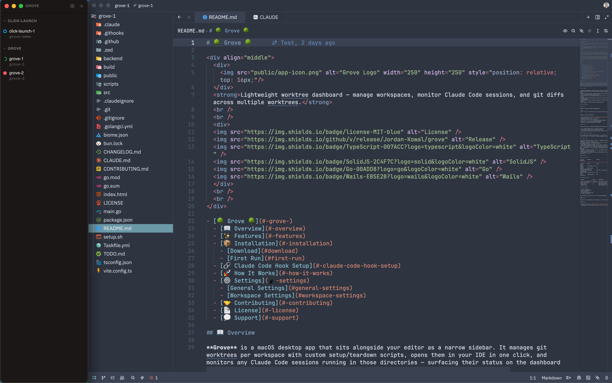
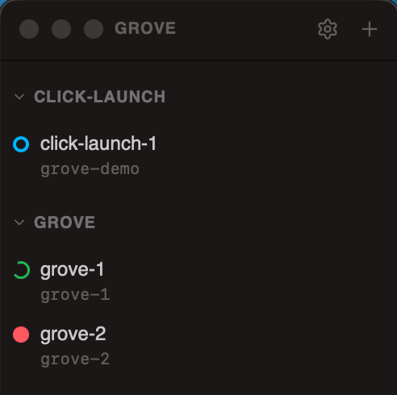
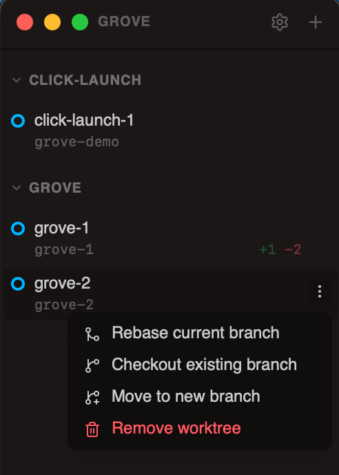
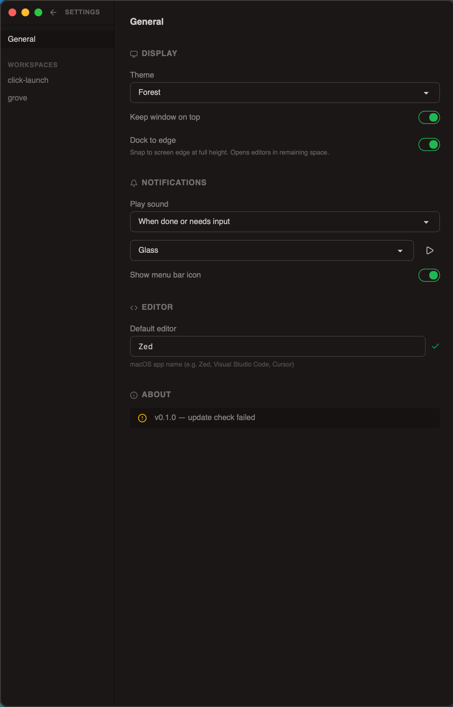
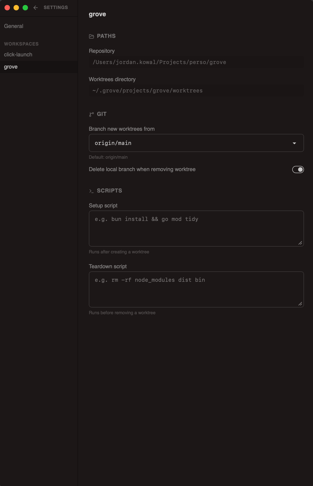

# 🌳 Grove 🌳

  

    
  

  <strong>Lightweight worktree dashboard — manage workspaces, monitor Claude Code sessions, and git diffs across multiple worktrees.</strong>
   
   
  

  
  
  
  
  
  
  

   
   

- [🌳 Grove 🌳](#-grove-)
  - [📖 Overview](#-overview)
  - [✨ Features](#-features)
  - [📦 Installation](#-installation)
    - [Download](#download)
    - [Requirements](#requirements)
  - [🚀 How It Works](#-how-it-works)
  - [⚙️ Settings](#️-settings)
    - [General Settings](#general-settings)
    - [Workspace Settings](#workspace-settings)
  - [🤝 Contributing](#-contributing)
  - [📄 License](#-license)
  - [💬 Support](#-support)

## 📖 Overview

**Grove** is a macOS desktop app that sits alongside your editor as a narrow sidebar. It manages git worktrees per workspace with custom setup/teardown scripts, opens them in your IDE in one click, and monitors any Claude Code sessions running in those directories — surfacing their status on the dashboard with sound/badge notifications.

  
    
  
  &nbsp;&nbsp;
  
    
  
  &nbsp;&nbsp;
  

## ✨ Features

- **Worktree management**: Create and remove worktrees per workspace, with git diff stats, custom setup and teardown scripts, live logs, and quick actions (rebase on branch, checkout branch, start fresh from new branch)
- **Main repo tracking**: The main working tree is always visible as a card alongside worktrees and tracked the same way (git diff, Claude sessions, editor badge)
- **Claude Code monitoring**: Auto-detect Claude Code sessions in worktree directories and the main repo, display live status, and notify with sound and dock badge. Multi-session badge with per-status hover breakdown when several sessions run in one directory
- **Open in IDE**: Pick your editor (Zed, VS Code, Cursor, etc.) and open any worktree or workspace root in one click. Cards show an "active" badge when the editor window is currently open, and you can close it from the card's context menu
- **Context-menu bulk actions**: Remove all worktrees, close all editor windows for a workspace, sync main checkout (reset main working tree to HEAD), copy branch name
- **Sidebar mode**: Dock the window to the side of the screen, keep it always on top, and open your IDE in the remaining space
- **Customizable**: Theme, notification sounds, dock badge, system tray icon, per-workspace scripts and git settings
- **Auto-update**: One-click update from GitHub releases

## 📦 Installation

### Download

**[⬇️ Download Grove 0.3.0 for macOS](https://github.com/Jordan-Kowal/grove/releases/download/0.3.0/Grove-0.3.0.dmg)**

1. Click the download link above (or grab it from the [Releases page](https://github.com/Jordan-Kowal/grove/releases))
2. Double-click the DMG to open it
3. Drag `Grove.app` onto the `Applications` folder shortcut
4. Launch Grove from Applications or Spotlight

### Requirements

Grove is signed and notarized by Apple, so it launches without any security warnings. On first run, a few items need your attention:

- **Claude Code hooks** — Grove installs a hook script at `~/.grove/hook.sh` and merges required hooks into `~/.claude/settings.json` automatically on startup. Grove relies on these hooks to track session state — keep them enabled.
- **AppleEvents permission** — Grove will prompt you the first time it tries to control your editor (e.g. opening a worktree in Zed/VSCode). Click **OK** on the native dialog.
- **Accessibility permission** — required only for Sidebar mode ("Dock to edge"). Enable it manually via **System Settings** → **Privacy & Security** → **Accessibility**. A direct link is available in Grove's settings.

## 🚀 How It Works

- **Storage**: All data lives in `~/.grove/` — workspace configs in `projects/<name>/config.json`, worktrees in `projects/<name>/worktrees/`
- **Worktree lifecycle**: Creating a worktree runs `git worktree add` then your setup script. Deleting runs your teardown script then `git worktree remove`
- **Git diffs**: Captured by polling `git diff HEAD --shortstat` on each worktree every 10 seconds
- **Claude monitoring**: On startup, Grove installs a hook script (`~/.grove/hook.sh`) and merges hooks into `~/.claude/settings.json`. These hooks make Claude write session state (working, permission, question, done) as JSON files in `~/.grove/sessions/`. Grove polls that directory every 2 seconds to update the dashboard
- **Sounds**: Notification sounds (`.aiff`) are embedded in the binary via Go's `embed` package and extracted to a cache on first use
- **Auto-update**: The frontend checks the GitHub Releases API for newer versions; the backend fetches the DMG pinned to the target tag, verifies the Apple Developer ID signature and Gatekeeper before copying into `/Applications/`, and writes all install output to `~/.grove/update.log` for diagnostics

## ⚙️ Settings

### General Settings

| Section       | Setting               | Default                  | Description                                                           |
| ------------- | --------------------- | ------------------------ | --------------------------------------------------------------------- |
| Display       | Theme                 | Forest                   | 35 built-in DaisyUI themes (Forest default)                           |
| Display       | Keep window on top    | On                       | Keep Grove above other windows                                        |
| Display       | Dock to edge          | On                       | Snap to screen edge at full height, open editors in remaining space   |
| Notifications | Play sound            | When done or needs input | Never, when done or needs input, or only when needs input             |
| Notifications | "Done" badge duration | 30 minutes               | How long the done badge persists: instant, 1–60 min, or until clicked |
| Notifications | Show menu bar icon    | Off                      | System tray icon to show/hide Grove                                   |
| Editor        | Default editor        | Zed                      | macOS app name (e.g. Zed, Visual Studio Code, Cursor)                 |

### Workspace Settings

| Setting                   | Default     | Description                                                                      |
| ------------------------- | ----------- | -------------------------------------------------------------------------------- |
| Repository path           | —           | Absolute path to the git repo this workspace tracks (read-only)                  |
| Branch new worktrees from | origin/main | Start point for new worktrees                                                    |
| Delete local branch       | On          | Clean up the branch after deleting a worktree                                    |
| Setup script              | —           | Shell command to run after creating a worktree                                   |
| Teardown script           | —           | Shell command to run before removing a worktree (`archiveScript` in config.json) |

## 🤝 Contributing

1. Fork the repository
2. Create a feature branch
3. Make your changes
4. Run tests and quality checks
5. Submit a pull request

See [CONTRIBUTING.md](CONTRIBUTING.md) for detailed guidelines.

## 📄 License

This project is licensed under the MIT License - see the [LICENSE](LICENSE) file for details.

## 💬 Support

- **Issues**: [GitHub Issues](https://github.com/Jordan-Kowal/grove/issues)
- **Discussions**: [GitHub Discussions](https://github.com/Jordan-Kowal/grove/discussions)
